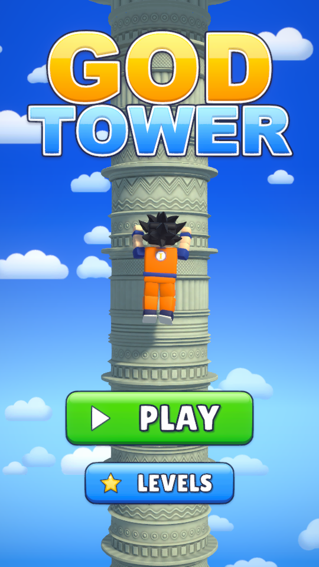
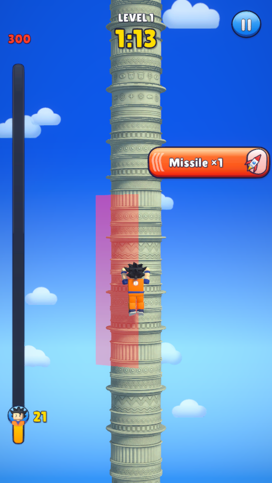
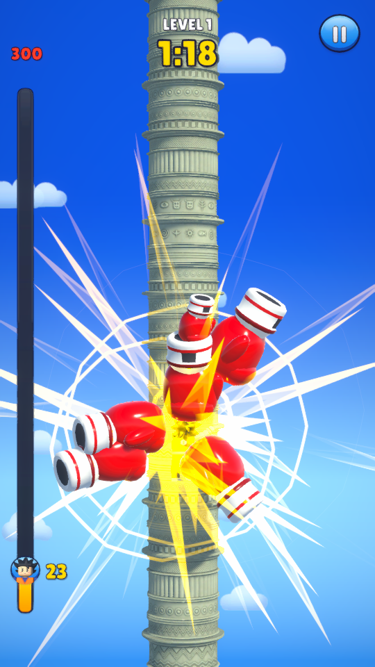
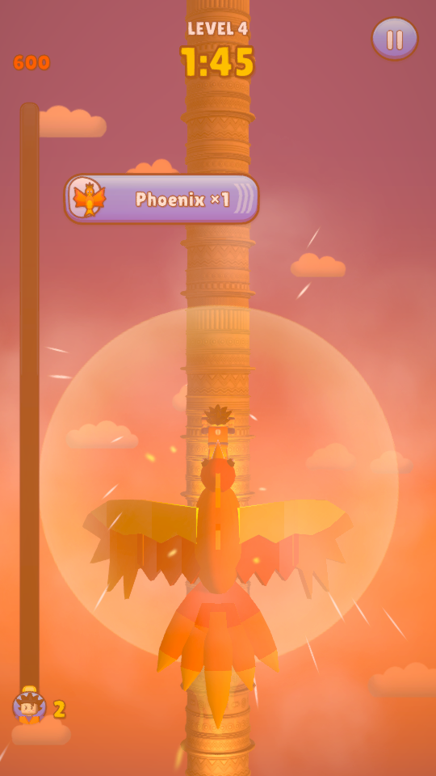
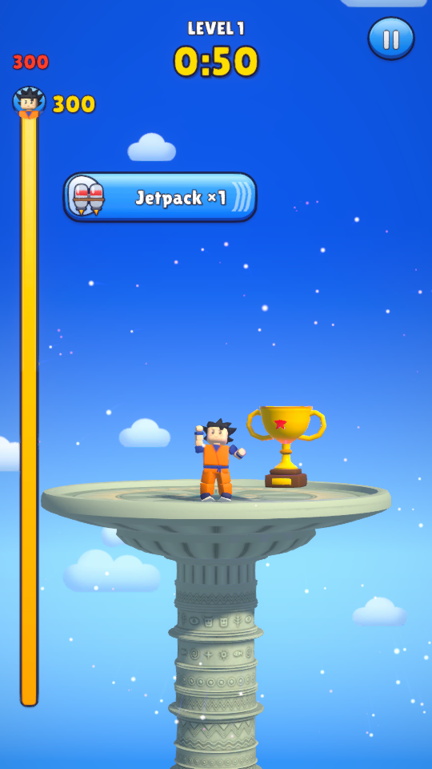
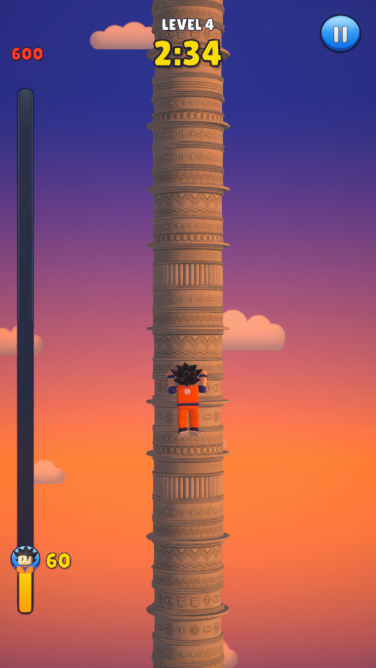
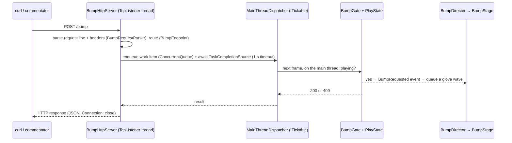
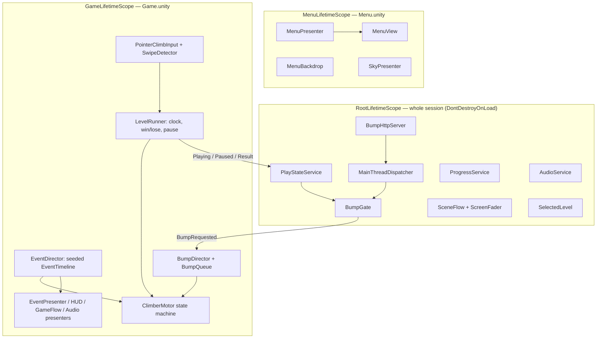

# God Tower — Unity Technical Test

This repository is my submission for a **Unity technical test** (Mid/Senior Game Developer): reproduce a reference
tower-climbing game ("God Tower") in Unity within 24 hours — 5 playable levels, Android APK — with one required
feature on top: a **local HTTP webhook (`/bump`) that triggers a full-screen boxing-glove hit**. The webhook is the
centrepiece of the test and of this README; everything else exists to give it a real game to land in.

- Engine: **Unity 6000.5.3f1** (Unity 6), URP, Input System; target Android (IL2CPP, ARM64, min API 26, portrait).
- Deliverables: `Builds/GodTower.apk` (43.6 MB, version 1.0.0, package `com.andreykopylkov.godtower`, debug-signed;
  built from this repo and distributed separately), a screen recording from a device, and this codebase.
- Art and audio: AI-generated by Claude agents through scripts kept in [`Tools/`](Tools) (Blender 5.2 Python, Pillow,
  numpy), plus two free Asset Store VFX packs and one OFL font. No paid assets, no human artists.

| Menu | Villain telegraph | `/bump` hit | Phoenix boost | Win | Level 4 sky |
|---|---|---|---|---|---|
|  |  |  |  |  |  |

*Screenshots are captures from the automated PlayMode tests (540×960 renders of the game camera).*

---

## How to play

- **Hold** anywhere to climb, **release** to hang in place.
- **Swipe left / right** (also while holding) to move between the 3 lanes on the front of the column.
- **Villains** (red banner on the right + red lane telegraph): missile, falling truck, spinning axes (two lanes at once).
  Be in another lane when they land, or you are knocked down 8% of the tower.
- **Hero events** (blue banner on the left) happen on their own: the jetpack carries you +10%, the phoenix +20%.
- Reach the dish on top before the timer runs out. Wins unlock the next level (saved); **Play** continues with the
  first unfinished level, **Levels** lets you replay any unlocked one. Pause: top-right button.

| Level | Height | Time | Villains (interval, telegraph) | Hero events | Sky |
|---|---|---|---|---|---|
| 1 | 300 m | 100 s | Missile (9 s, 1.0 s) | Jetpack ×2 | Day |
| 2 | 400 m | 130 s | Missile, Truck (8 s, 0.9 s) | Jetpack, Phoenix | Bright afternoon |
| 3 | 500 m | 160 s | + Axes (7 s, 0.8 s) | Jetpack ×2, Phoenix | Golden hour |
| 4 | 600 m | 190 s | All (6 s, 0.7 s) | Jetpack ×2, Phoenix | Sunset |
| 5 | 750 m | 230 s | All + back-to-back pairs (5 s, 0.6 s) | Jetpack ×2, Phoenix ×2 | Dusk |

---

## The webhook — `/bump`

While the game runs, it listens on **`http://localhost:56789/bump`** (IPv4 `127.0.0.1` and IPv6 `[::1]`, loopback only),
in the editor and in the APK alike. `GET` and `POST` are accepted; the body is ignored.

```bash
curl -X POST http://localhost:56789/bump
# {"status":"triggered"}
```

| Status | Body | When |
|---|---|---|
| `200 OK` | `{"status":"triggered"}` | A level is being played — the glove wave starts immediately |
| `409 Conflict` | `{"status":"ignored","reason":"not_playing"}` | Menu, pause, win/lose screen, scene transition |
| `400 Bad Request` | `{"status":"error","reason":"bad_request"}` | Malformed HTTP request |
| `404 Not Found` | `{"status":"error","reason":"not_found"}` | Any other path |
| `405 Method Not Allowed` | `{"status":"error","reason":"method_not_allowed"}` + `Allow: GET, POST` | Any other method |
| `500 Internal Server Error` | `{"status":"error","reason":"internal_error"}` | Unexpected exception while handling the request |
| `503 Service Unavailable` | `{"status":"error","reason":"main_thread_timeout"}` | The main thread did not answer within 1 s (app in the background) |

All responses are JSON with `Connection: close`. The `200`/`409` decision is made **on the main thread** at the moment
of the request, so the status code tells exactly whether the hit was triggered.

### Triggering it

**In the editor** — open `Assets/_Project/Scenes/Menu.unity`, press Play, start a level, then from any terminal:

```bash
curl -X POST http://localhost:56789/bump
curl http://localhost:56789/bump                       # GET works too
for i in 1 2 3 4 5; do curl -s -X POST http://localhost:56789/bump; done   # a storm: waves layer up
```

**On an Android device or emulator** — the game listens on the *device's* loopback, so forward the port from the PC:

```bash
adb forward tcp:56789 tcp:56789
curl -X POST http://localhost:56789/bump
```

`adb forward` makes `localhost:56789` **on the PC** reach port 56789 **on the device** — the direction needed for a
PC-side `curl`. `adb reverse` (mentioned in the brief) is the opposite direction (device → PC) and is only needed when
something *on the phone* has to reach a server on the PC, so it is not used here. The APK declares
`android.permission.INTERNET` (required to open the socket). No other setup is needed; a device on the same Wi-Fi
cannot reach the port directly because the listener is bound to loopback on purpose.

### What happens

Every accepted request starts one **glove wave**, visible across the whole screen:

- 6–8 big red 3D boxing gloves fly in from all four screen edges along bent arcs (PrimeTween), rolling into the punch
  and tracking the climber, then recoil;
- on contact: star impact bursts per glove, a comic **POW** burst, a full-screen white flash, a strong camera shake
  (Cinemachine impulse) and three punch sounds;
- gameplay: the hero plays the **Hit** reaction and drops ~9 m (a per-level share of the tower, capped at 2 bumps' worth
  per rolling 5 s so a spam storm cannot pin the player at the bottom); input locks for ≈0.55 s, then play continues.
  A bump that lands while the cap is reached or during a hero boost still plays a visual flinch.
- Spam-safe: up to 3 waves at once, 24 more queued, a watchdog frees any stuck wave; waves only start while the
  level runs and freeze with the pause. Nothing can soft-lock the level.

### Request flow



No Unity API is touched off the main thread; a work item that times out is cancelled and never runs later.

---

## Architecture

Dependency injection with **VContainer** (three scopes), async with **UniTask**, tweens with **PrimeTween**, camera
with **Cinemachine 3**. Game logic is plain C# (testable without scenes); MonoBehaviours are views and stages.



- **Climber**: `ClimberMotor` is a pure state machine (Idle, Climb, Shift, Hit, Fall, Carried, Win, Lose) on scaled
  delta time; `ClimberView` maps states 1:1 to Animator states of the Humanoid hero.
- **Levels**: `LevelConfig` assets (generated from one table in `GameAssetsBuilder`), seeded `EventTimeline`
  (deterministic per level), `TowerBuilder` stacks the tower segments to the exact level height.
- **Effects**: villains are decided by lane at impact time (`EventDirector`) and animated on the level clock
  (`EventStage`), so visuals and outcome never disagree and both freeze on pause.
- **Scenes and assets are generated by editor code** (`SceneBuilder`, `GameHudBuilder`, `MenuUiBuilder`, `*Setup`,
  `GameAssetsBuilder`) — the project was built entirely from the command line with the editor closed; to change a
  scene, change its builder and run `SetupProject`.

```
Assets/
  _Project/
    Scripts/  Core/ Webhook/ Gameplay/ Levels/ Events/ Effects/ Environment/ Audio/ UI/ Scopes/   (GodTower.Runtime)
              Editor/   CLI entry points, importers, scene/UI/config builders, validator         (GodTower.Editor)
    Configs/ Prefabs/ Scenes/ Materials/ Animation/ Audio/Generated/ Shaders/ Settings/ UI/Generated/
  Art/        Characters/Hero  Environment/{Tower,Sky}  Props  UI/{Kit,Banners,Icons,Logo}  Fonts/LilitaOne
  Tests/      EditMode (pure logic)   PlayMode (scenes, real HTTP, autoplay)
Tools/        Blender/ Images/ Audio/ Video/   — generators for every original asset + the recording script
Docs/         Plan.md, Tracklist.md, Status/*.md (agent logs, decisions.md), Media/
```

---

## Build, test and run from the command line

The editor must be closed (one Unity process per project).

```bash
UNITY="/c/Program Files/Unity/Hub/Editor/6000.5.3f1/Editor/Unity.exe"
P="$(pwd)"

# Regenerate settings, import settings, configs, prefabs and scenes (after changing any builder)
"$UNITY" -batchmode -quit -projectPath "$P" -executeMethod GodTower.Editor.BuildTools.SetupProject -logFile Logs/setup.log

# Tests — always pass -assemblyNames (Input System test assemblies are "testables" and would run too)
"$UNITY" -batchmode -projectPath "$P" -runTests -testPlatform EditMode -assemblyNames GodTower.Tests.EditMode -testResults TestResults/editmode.xml -logFile Logs/editmode.log
"$UNITY" -batchmode -projectPath "$P" -runTests -testPlatform PlayMode -assemblyNames GodTower.Tests.PlayMode -testResults TestResults/playmode.xml -logFile Logs/playmode.log

# Asset hygiene: missing scripts/references, Asset Store demo content in the build (exit code 1 on problems)
"$UNITY" -batchmode -quit -projectPath "$P" -executeMethod GodTower.Editor.BuildTools.ValidateProject -logFile Logs/validate.log

# APK -> Builds/GodTower.apk (IL2CPP ARM64; Android SDK/NDK/JDK bundled with the editor)
"$UNITY" -batchmode -quit -projectPath "$P" -buildTarget Android -executeMethod GodTower.Editor.BuildTools.BuildAndroid -logFile Logs/build.log
```

What the tests cover:

- **EditMode** — HTTP parsing/reading/routing/responses, main-thread dispatcher and timeouts, bump gate, play state,
  swipe detection, lanes, knockdown and bump caps, climber state machine, tower layout, event timelines, bump queue,
  glove arcs, progress, audio library, project validation.
- **PlayMode** — the webhook over real `HttpClient` (200/409/404/405/400, bodies, 10 parallel requests), level
  mechanics, villains, bump effect (single and storm of 20), menu/pause/result flow with real UI raycasts, and
  **autoplay**: a bot (hold + swipe away from telegraphed lanes) plays each level while "commentators" post `/bump`
  every 4–10 s; pass = win before the timer, every in-play bump answered 200, no error logged. The **full-flow** test
  plays Menu → Level 1 … 5 → Menu in one go from fresh progress (unlocks, Next buttons, 409 on result screens). Levels
  run at 4× time scale (all gameplay is frame-rate independent), ≈3 min each for the autoplay set and the full flow.
  Current totals: **157 EditMode + 26 PlayMode tests, all green** (PlayMode ≈ 6.5 min).

**Recording the video**: `uv run Tools/Video/record_playthrough.py` drives the installed APK over adb (taps, holds,
swipes that dodge the seeded villains, `/bump` every 7–14 s through `adb forward`) and records with `scrcpy`;
`--dry-run` prints the plan without a device. See the script header for requirements.

---

## Third-party assets and licenses

| Asset | Author | Used for | License | Source | In repo |
|---|---|---|---|---|---|
| VContainer 1.19.0 | hadashiA | Dependency injection | MIT | [GitHub](https://github.com/hadashiA/VContainer) | UPM (git) |
| UniTask 2.5.11 | Cysharp | Async/await | MIT | [GitHub](https://github.com/Cysharp/UniTask) | UPM (git) |
| PrimeTween 1.3.3 | Kyrylo Kuzyk | Tweens (gloves, UI) | PrimeTween license (free use in games via UPM) | [GitHub](https://github.com/KyryloKuzyk/PrimeTween) / [OpenUPM](https://openupm.com/packages/com.kyrylokuzyk.primetween/) | UPM |
| Cinemachine 3.1.7, URP, Input System, TextMesh Pro | Unity | Camera, rendering, input, text | Unity Companion License | Unity Package Manager | UPM / TMP essentials |
| Cartoon FX Remaster Free | Jean Moreno (JMO) | Explosions, impacts, POW, firework, fire | Standard Unity Asset Store EULA | [Asset Store](https://assetstore.unity.com/packages/vfx/particles/cartoon-fx-remaster-free-109565) | **No** — import manually |
| Magic Effects FREE | Hovl Studio | Phoenix burst | Standard Unity Asset Store EULA | [Asset Store](https://assetstore.unity.com/packages/vfx/particles/spells/magic-effects-free-247933) | **No** — import manually |
| Lilita One | Juan Montoreano | UI font | SIL Open Font License 1.1 (`OFL.txt` included) | [Google Fonts](https://fonts.google.com/specimen/Lilita+One) | Yes |

### AI-generated assets (made for this project)

Every original asset was produced by **Claude agents** (Anthropic) writing generator scripts — no image-generation,
image-to-3D or music-generation service was available, and no human artist was involved. All generators are
deterministic and kept in `Tools/`, so every asset can be rebuilt:

| Asset | Made with | Regenerate (from the repo root) |
|---|---|---|
| Hero: 3.4k-tris Humanoid model, rig, 9 clips, texture atlas (`Assets/Art/Characters/Hero`) | Blender 5.2 Python (procedural blocks, keyframed animation) + Pillow | `bash Tools/Blender/Hero/build_all.sh` |
| Tower: 4 tileable column segments + top dish, stone atlas + normal maps (`Assets/Art/Environment/Tower`) | Blender 5.2 Python + numpy/scipy/Pillow textures | `uv run --with numpy --with scipy --with pillow python Tools/Blender/Environment/tower_textures.py` (+ `platform_textures.py`), then `blender -b --factory-startup --python Tools/Blender/Environment/build_tower.py` (+ `build_platform.py`) |
| Props: boxing glove, missile, truck, axe, jetpack, phoenix (+ flap loop), trophy (`Assets/Art/Props`) | Blender 5.2 Python, one shared palette material | `blender -b --factory-startup --python Tools/Blender/Props/build_<asset>.py` |
| UI kit, banners, 14 icons, logo, app icon, clouds (`Assets/Art/UI`, `Assets/Art/Environment/Sky`) | Pillow + numpy/scipy (procedural vector-style rendering) | `uv run --with pillow --with numpy --with scipy python Tools/Images/generate_all.py` |
| 22 SFX + menu/level music loops (`Assets/_Project/Audio/Generated`) | numpy/scipy synthesis (oscillators, noise, filters, ADSR, reverb) | `uv run --with numpy --with scipy --with pyloudnorm python Tools/Audio/generate_all.py` |
| Hero portrait for the height marker, sky gradient skybox, post-processing | Unity editor code (`HeroIconRenderer`, `SkySetup`, `RenderingSetup`) | `BuildTools.SetupProject` |

### Importing the Asset Store packages

The Standard Unity Asset Store EULA allows these packs inside a shipped game (they are in the APK) but not public
redistribution of their source files, so they are git-ignored. **The game runs without them** — every effect
reference is null-checked and simply skipped (no explosions/impact particles, gloves and gameplay still work). To get
the full look:

1. Add *Cartoon FX Remaster Free* and *Magic Effects FREE* to your Unity account (links above).
2. Open the project, **Window → Package Manager → My Assets**, import both (they land in `Assets/JMO Assets` and
   `Assets/Hovl Studio`).
3. Configs and prefabs reference the effects by GUID and relink automatically; if anything is still missing, run
   `BuildTools.SetupProject` (menu **GodTower → Setup Project**).

---

## Assumptions and decisions

The brief and reference video leave a lot open; every call was logged in
[`Docs/Status/decisions.md`](Docs/Status/decisions.md). The important ones:

**Gameplay (reproducing the reference)**
- Portrait 9:16 (the reference video), reference UI resolution 1080×1920. 3 lanes on the front of the column at
  −35° / 0° / +35°; a lane hop takes 0.2 s; swipe = ≥ 8% of the screen width within 0.35 s, also while holding.
- Climb speed 6.6 m/s. Villains are scripted on a seeded per-level timeline (not aimed at the player), telegraphed by a
  red banner + red lane strip; a hit = Hit → Fall, 8% of the tower. Hero events are automatic (jetpack +10% / 2 s,
  phoenix +20% / 3 s, immune while carried). Lose = timer at 0; no lives, no score — the reference shows none.
- Progress = levels completed in order (`PlayerPrefs`); Play continues with the first unfinished level.

**Webhook**
- `TcpListener` instead of `HttpListener` (no URL ACL/permission quirks on Android or Windows), loopback only, also
  on IPv6 `[::1]` because Windows resolves `localhost` to `::1` first (a missing IPv6 listener cost ~2 s per curl).
- Lenient parser (lowercase methods, absolute-form targets, LF-only lines accepted); `/bump/` is a 404.
- A bump costs ~9 m on every tower (per-level share 3% → 1.2%), capped at 2 bumps per rolling 5 s, ≈0.55 s input lock;
  the hit lands on the first glove contact (≈0.35 s after the request). Spam beyond 3 concurrent + 24 queued waves is
  dropped but still answered 200 (it was accepted while playing).
- PC → device uses `adb forward tcp:56789 tcp:56789`, not `adb reverse` (see above).

**Visuals**
- Camera: fixed-rotation follow camera far from the tower (58 m, FOV 28°, 38° zoom-out during the phoenix),
  climber seen from the back like the reference. A portrait screen cannot show both the reference's column width and
  hero size with a 1.8 m hero on a 3.6 m column, so the column takes ~20% of the width and the hero visual is scaled
  1.75× (≈ 11% of the screen height); gameplay distances are unchanged.
- Five sky presets (day → dusk) as visible level progression; procedural gradient skybox + parallax cloud sprites.
- Original Roblox-style blocky hero (orange gi, black spiky hair) — inspired by the reference, no franchise marks.

**Tuning (found by the autoplay tests)**
- With the starting level table the bot lost Levels 2–5 under a bump every 4–10 s (3% of a 750 m tower = 22 m per
  bump). Per-level bump share and longer time limits (later raised to 100/130/160/190/230 s after the on-device rehearsal) were introduced; heights, villain
  intervals, telegraphs and hero events are unchanged, so difficulty still rises level to level. The bot wins with a
  ≥ 10% time margin (64 / 97 / ~86 / 136 / ~150 s).

**Process**
- Built overnight by autonomous Claude agents (Unity, character, environment, image, sound lanes) on a CLI-only
  workflow with the editor closed: scenes, UI and configs are generated by editor code, not hand-edited.
- No image/3D/music generation tools were available, so all "AI-generated" art is procedural (scripts in `Tools/`).
- The Asset Store VFX packs are not committed (EULA), Dustyroom's CC0 SFX pack was dropped in favour of generated
  UI sounds with a consistent timbre.

---

## Known issues

- Not yet verified on a physical device at the time of writing (frame rate, touch feel and safe areas were checked in
  the editor and by automated tests only).
- The Unity log shows a benign "animation import warnings" note for `Hero_Animations.fbx` (avatar and clips are valid).
- Side lanes put the climber close to the column's silhouette edge from the camera's point of view.
- The jetpack flame leaves a dark smoke puff below the climber.
- Glove waves start just outside the screen edges: the first ~0.2 s of a wave shows nothing; contact at ≈0.35 s.
- The lose panel reuses the retry glyph as its icon.
- Blocky rigid-skinned hero: small gaps at elbows and knees on strong bends (intended toy look).
- Sounds were generated and level-checked numerically, not tuned by ear.
